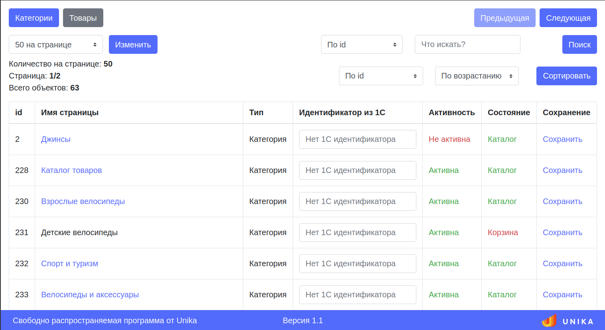

[](https://unikaweb.ru/)
# 1C-UMI Explorer — Unika
Протестировано на 20 и 21 версиях UMI.CMS. Требуемая версия PHP 7.1 или выше.
___
Расширение для UMI.CMS, позволяющее в удобной форме просматривать и редактировать идентификаторы 1С.  
`Свободно распространяемая программа от Unika`

## Установка
1.  Поместить все файлы в корневую папку сайта, так, чтобы файл `get_1c_id.php` был доступен по адресу `https://site.ru/get_1c_id.php`.
2.  В конец файла `.htaccess` добавить правило:  
    ```apacheconfig
    <FilesMatch "^get_1c_id\.php$">
      Allow from all
      php_flag engine on
    </FilesMatch>
    ```
## Использование
### Перед использованием, обязательно сделайте бэкап БД!
1.  Инструмент использует учетную запись и требует прав супервайзера, поэтому сначала нужно авторизоваться.
2.  Дописать после домена `/get_1c_id.php`. Ссылка должна выглядеть таким образом `https://site.ru/get_1c_id.php`.
___
Идею скрипта для проверки пользователя взяли у [e-ioffe](https://github.com/e-ioffe)
## Версии
1.1.0.  Добавлены столбцы с типом и состоянием. Доработан поиск.  
1.1.1.  Добавлена сортировка по состоянию.
